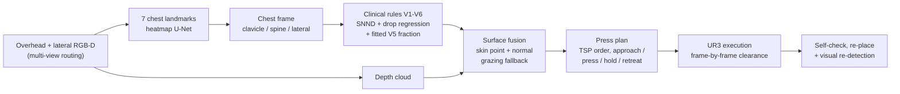

# RoboECG

**English** | [简体中文](README.zh-CN.md)


**Autonomous robotic placement of 12-lead ECG precordial electrodes (V1–V6) in Isaac Sim.**


A robot arm perceives a supine patient's chest with an overhead depth camera, works out where the six
precordial ECG electrodes belong, presses them onto the skin and then checks its own work — no human in
the loop after the patient is in place. Everything runs in NVIDIA Isaac Sim 6.0.1 with a UR3 arm.

The task is a gap in the published literature. Existing work on ECG electrode placement falls into two
groups: systems that *detect electrodes which have already been placed* (RGB-D detection + registration)
and systems that *predict where an electrode should go* (MRI or geometric models, usually offline). The
execution side — localisation → reach → press → self-check → re-place — is left open. This repository
implements that loop end to end and, more importantly, validates the localisation rules against
independently published electrode data instead of against its own assumptions.

## Results

| | Result |
|---|---|
| Autonomous placement (depth → landmark net → rules → fusion → press), 6 electrodes | **6/6 first-attempt success**, contact error 0.14–0.36 mm, zero safety back-offs, min clearance 33 mm |
| Target localisation from depth (60 held-out scenes, 360 placements) | **6.08 mm** mean (95% CI 5.53–6.64), no generation failures; cross-seed 5.89 ± 0.22 mm (3 seeds) |
| Robustness: 11 configurations (body scale 0.90–1.10, arm 60–90°, breathing ±8 mm, camera ±4 cm, patient ±2 cm) | baseline 3.4 mm, worst 9.0 mm (body scale 1.10), mean 4.3 mm with the anchored multi-view snap — within the ≤10 mm acceptance |
| Rule check against independent electrode data (25 statistical-shape torsos) | V5 lateral position LOO 2.5 mm; intercostal drop regression R² = 0.81 |
| Real patient check (PhysioNet/CinC 2007, 120 measured electrodes) | sternal-notch rule −3.9 mm; the drop regression overestimates by 26.5 mm (kept as a documented limitation) |
| In-Isaac transfer to real torso geometry (25 shape models, non-circular electrode GT) | raw **41.7 mm** mean target error; **18.8 / 15.6 mm** with leave-one-out population calibration (similarity / per-electrode; 14/25 and 19/25 models ≤ 20 mm) |
| Direct-regression upper bound on the same split | 2.9 mm vs 6.1 mm for the landmark → frame → rule chain |
| Patient-size sweep | clearance ≥ 21 mm for all five body scales |

> Metric note: the localisation numbers above are measured against the project's **own rule targets
> on the same simulated surface** (perception-chain deviation / surface-source difference) — they
> are **not** clinical accuracy. The independent placement evidence is the rule check against the
> two public electrode datasets (25-shape-model cohort and one real patient). Full metric taxonomy:
> [`docs/ECG_V3_SOLUTION_PLAN.md`](docs/ECG_V3_SOLUTION_PLAN.md) §7.1.

## Demos

Autonomous cycle — the perception path (depth → learned landmarks → clinical rules → fusion → press →
verify). ~4× speed:


Per-target reach with the arm parking at V6 (midaxillary line), ~3× speed:


The full-rate videos are in [`runs/m4/`](runs/m4) and [`runs/m1/`](runs/m1).

## How it works



Two design choices are worth calling out.

**The learnt component is the anatomy, not the electrodes.** The depth network predicts seven chest
landmarks (clavicles, shoulders, sternum, neck base, pelvis); the electrode positions are then computed
by explicit clinical rules. Training the network to regress electrode coordinates directly is a shortcut
that hits 2.9 mm in simulation, but it has no label source outside simulation. Keeping the rules in the
chain means the same code can be re-calibrated from measured electrode data, which is exactly what the
independent validation below did.

**Sharp geometry gets a second view and an explicit fallback.** The lateral chest wall (V5, V6) is
nearly parallel to the overhead camera rays; the multi-view path routes those targets to a fixed side
camera that sees the wall frontally (anchored-snap error 77 → 9.7 mm, `--multiview`). For the overhead
path the grazing fallback remains: incidences above 65° keep the model surface instead of the depth
measurement, and the planner treats the target as a rigid contact rather than a free point.

## Repository layout

```
roboecg/          core package
  perception/     chest landmarks, landmark U-Net, depth utilities
  target_localization/  chest frame, clinical rules, depth fusion
  robot_controller/     IK, reach/press planning, collision proxies
  task_manager/   scene, supine pose, M0-M4 demos, perception pipeline
scripts/          entry points (one per milestone / experiment)
configs/          clinical rule parameters with provenance tags
tests/            70 logic-only tests (no Isaac Sim needed)
assets/           trained models + the two external validation datasets
docs/             detailed technical reports (Chinese)
runs/             reports, figures and videos produced by the scripts
```

## Quick start

The logic layer — chest frame, rule generation, fusion gates, press planning — does not need Isaac Sim:

```bash
pip install numpy pyyaml pytest
python -m pytest tests/            # 70 tests, < 1 s
```

The perception and execution demos need Isaac Sim 6.0.1 (Python 3.11+, GPU):

```bash
./scripts/run_headless.sh scripts/m0_check_ecg_scene.py        # scene + reachability audit
./scripts/run_headless.sh scripts/m1_ecg_reach.py              # rules -> targets -> reach + video
./scripts/run_headless.sh scripts/m2_ecg_depth.py              # RGB-D fusion
./scripts/run_headless.sh scripts/m4_ecg_place.py --perception # full autonomous cycle
```

Training the landmark network (600 synthetic renders, ~10 min on a laptop GPU):

```bash
./scripts/run_headless.sh scripts/gen_ecg_synth_dataset.py --samples 600
python scripts/train_chest_landmark_v2.py --epochs 200
python scripts/m3b_ecg_detector_eval.py
```

## Validation data

Two published datasets are used to check the rules. Both are independent of this project, which is the
point: a rule validated against its own output cannot fail.

* **25 statistical-shape torso models with standard 12-lead electrode positions**
  (Bender et al., Zenodo [10.5281/zenodo.20086105](https://doi.org/10.5281/zenodo.20086105), CC-BY-4.0).
  Used to calibrate and to check the rules; this is where the original 4.3× error in the intercostal
  drop (a flat 20 mm assumption vs. 86.7 mm measured) was found and fixed.
* **PhysioNet/CinC Challenge 2007 case 3** — a real patient torso with 120 measured electrode
  positions (Dalhousie, ODC-By 1.0). The standard-lead subset is defined explicitly in the challenge
  readme; the 4th-intercostal rule reproduces the measured V1/V2 level to 3.9 mm, and the drop
  regression is 26.5 mm optimistic on this patient.
* **In-Isaac transfer to the same 25 shape models** (I5) — the torso surfaces are imported into the
  Isaac scene (biped hidden) and the full perception chain (fine-tuned detector → frame → rules →
  fusion) places V1–V6, compared against the models' real electrode coordinates (the only
  non-circular end-to-end metric here). Raw population mean 41.7 mm; leave-one-out population
  calibration 18.8 mm (similarity) / 15.6 mm (per-electrode table), 19/25 models ≤ 20 mm.
  See the [v3 plan](docs/ECG_V3_SOLUTION_PLAN.md) §3.3.

## Limitations

These are the things I would fix first if this were a hardware project:

* **The lateral wall has a second view; a wrist camera is still open.** V5/V6 sit on a near-vertical
  wall that the overhead camera cannot see, so the multi-view path routes them to a fixed side camera
  (anchored-snap error 77 → 9.7 mm; `--multiview`). A wrist-camera variant that observes the contact
  neighbourhood during the press remains future work.
* **The drop regression is a population prior, not clinical accuracy.** It is fitted on 25 shape
  models, and the one real patient we could check sits ~27 mm below the prediction.
* **Simulation only.** No real arm, no real skin. The stock press is position-controlled with a linear
  engineering contact model; the breathing experiment (a ±8 mm chest motion during the hold) pushes
  the indentation to 12 mm and the force to 1.8 N, i.e. past both limits. A compliant force-feedback
  press is now designed, simulated (21 scenarios) and **validated inside the Isaac execution chain**
  (`--force-tracking`: 6/6 electrodes, force 0.64–0.66 N, indentation 4.3–4.5 mm under breathing,
  zero cap violations, settled force RMSE ≤ 0.03 N) — see the [v3 plan](docs/ECG_V3_SOLUTION_PLAN.md);
  real-robot admittance control is still open.
* **Stylised body, now quantified.** The patient asset is smooth and out-of-population on the lateral
  wall (V6 wall steepness −16σ, V4→V6 wrap ratio −3.0σ against the 25 shape models). I5 imports the
  real torso surfaces into Isaac, fine-tunes the detector on 75 pseudo-labelled renders and calibrates
  the transfer on the population — raw 41.7 mm, leave-one-out 18.8/15.6 mm
  ([v3 plan](docs/ECG_V3_SOLUTION_PLAN.md) §3.3).

## Roadmap

The simulation loop is complete; the parts that a real system needs are still open:

- [x] Force-controlled press — design + numeric study (21 scenarios) and an in-Isaac validation run
      (`--force-tracking`, 6/6, zero violations) are done; the real-robot admittance control is
      specified in [docs/ECG_M5_ROBOT_ROADMAP.md](docs/ECG_M5_ROBOT_ROADMAP.md) and still needs hardware.
- [x] A second view to measure the lateral wall (V5/V6) — integrated into the perception pipeline
      (`--multiview`); the detector is fine-tuned on real SSM torso renders and the transfer is
      calibrated leave-one-out (I5, [v3 plan](docs/ECG_V3_SOLUTION_PLAN.md) §3.3). A wrist-camera
      variant remains open.
- [ ] A learned approach policy (VLA / RL) on top of the rule-based target generator.
- [ ] Signal-side verification: acquire a short 12-lead record after placement and check for
      misplacement, closing the loop on the physiological signal rather than on geometry.

## Documentation

Detailed milestone reports (Chinese) are in [`docs/`](docs), including the pipeline plan, per-milestone
findings, the independent ground-truth validation, the real-patient check, the
[I4 contact-probe protocol](docs/ECG_I4B_PROBE_PROTOCOL.md), the
[real-robot roadmap](docs/ECG_M5_ROBOT_ROADMAP.md), and the literature-driven
[v3 plan for the open limitations](docs/ECG_V3_SOLUTION_PLAN.md).

## Acknowledgements

Biped body asset from the NVIDIA Isaac Sim sample assets. External validation data as cited above
(CC-BY-4.0 and ODC-By 1.0); the datasets are redistributed here with attribution and keep their
original licences. The robot model is the official UR3 USD shipped with Isaac Sim.

Code: MIT (see `LICENSE`). If you use this software, see [`CITATION.cff`](CITATION.cff).

## Author

Xinyu Jiang ([@Jxy-yxJ](https://github.com/Jxy-yxJ), jiaoxiangyue3@gmail.com) — medical robotics,
embodied AI and multimodal perception. Happy to answer questions or discuss collaboration; issues and
emails are both fine.
