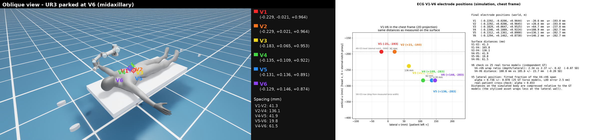
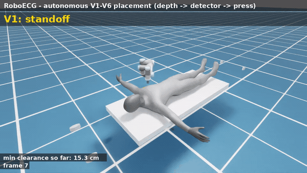
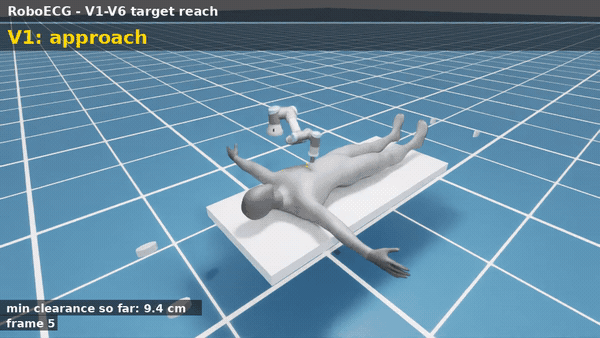
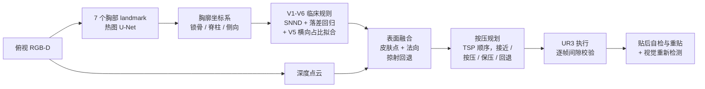

# RoboECG

[English](README.md) | **简体中文**


**在 Isaac Sim 中让机械臂自主定位并贴放 12 导联 ECG 胸导联（V1–V6）。**



机械臂用俯视相机感知仰卧患者的胸廓，算出六个胸导联电极应该贴在哪里，逐个按压到皮肤上，
最后再自己检查一遍位置——患者躺好之后全程不需要人手介入。整个流程运行在
NVIDIA Isaac Sim 6.0.1 + UR3 上。

这件事在公开文献里恰好是空白。现有的 ECG 电极相关工作分两类：一类**检测已经贴好的电极**
（RGB-D 检测 + 配准），另一类**预测电极应该贴在哪**（心脏 MRI 或几何模型，通常离线）。
而"定位 → 到达 → 按压 → 自检 → 重贴"这一执行闭环始终没有人做。本仓库在仿真中补齐了这个
闭环，更重要的是：**用独立公开的电极数据验证定位规则**，而不是拿规则自己的输出当标准答案。

## 结果

| 项目 | 结果 |
|---|---|
| 自主贴放（深度 → landmark 网络 → 临床规则 → 深度融合 → 按压），6 个电极 | **6/6 一次成功**，接触误差 0.14–0.36 mm，零安全回退，最小间隙 33 mm |
| 深度目标定位精度（60 个留出场景、360 次贴放） | 均值 **6.08 mm**（95% CI 5.53–6.64），无生成失败 |
| 鲁棒性：11 组扰动（体型 0.90–1.10、手臂 60–90°、呼吸 ±8 mm、相机 ±4 cm、患者 ±2 cm） | 最差 8.5 mm、均值 5.8 mm，与标称场景持平 |
| 规则 vs 独立电极数据（25 个统计形状躯干模型） | V5 横向位置留一误差 2.5 mm；肋间落差回归 R² = 0.81 |
| 真实患者核验（PhysioNet/CinC 2007，120 个实测电极） | 胸骨切迹规则 −3.9 mm；落差回归高估 26.5 mm（已作为已知局限记录） |
| 同一验证集上的直接回归上限 | 2.9 mm vs 规则链条 6.1 mm |
| 体型扫描 | 5 档体型最小间隙均 ≥ 21 mm |

## 演示

自主贴放全过程（感知路径：深度 → 学习式 landmark → 临床规则 → 融合 → 按压 → 自检），约 4× 速：



逐点到达演示（机械臂最终停在 V6 腋中线），约 3× 速：



原速视频在 [`runs/m4/`](runs/m4) 与 [`runs/m1/`](runs/m1)。

## 工作原理



有两个设计选择值得单独说明。

**学习层学的是解剖结构，不是电极坐标。** 深度网络只预测七个胸部 landmark（锁骨、肩、胸骨、
颈底、骨盆），电极位置再由显式的临床规则算出。直接回归电极坐标在仿真里能到 2.9 mm，
但它出了仿真就没有标签来源；把规则留在链条里，同一个代码就可以用**实测电极数据重新标定**
——下面那次独立验证正是这么做的。

**病态几何要显式兜底。** 侧胸壁（V5、V6）几乎与俯视相机的光线平行：那里的深度测量没有信息量，
曲面拟合也病态。因此入射角超过 65° 的目标直接保留模型表面，规划器把它当作刚性接触点而非自由点。

## 仓库结构

```
roboecg/          核心包
  perception/     胸部 landmark、landmark U-Net、深度工具
  target_localization/  胸廓坐标系、临床规则、深度融合
  robot_controller/     IK、到达/按压规划、碰撞代理
  task_manager/   场景、仰卧姿态、M0-M4 演示、感知管线
scripts/          入口脚本（每个里程碑 / 实验一个）
configs/          临床规则参数（带 provenance 标注）
tests/            42 个纯逻辑单测（不依赖 Isaac Sim）
assets/           训练好的模型 + 两个外部验证数据集
docs/             详细技术报告（中文）
runs/             全部报告、图片与视频
```

## 快速开始

逻辑层——胸廓坐标系、规则生成、融合门限、按压规划——不需要 Isaac Sim：

```bash
pip install numpy pyyaml pytest
python -m pytest tests/            # 42 个测试，< 1 s
```

感知与执行演示需要 Isaac Sim 6.0.1（Python 3.11+，GPU）：

```bash
./scripts/run_headless.sh scripts/m0_check_ecg_scene.py        # 场景 + 可达性审计
./scripts/run_headless.sh scripts/m1_ecg_reach.py              # 规则 -> 目标 -> 到达 + 视频
./scripts/run_headless.sh scripts/m2_ecg_depth.py              # RGB-D 深度融合
./scripts/run_headless.sh scripts/m4_ecg_place.py --perception # 完整自主循环
```

训练 landmark 网络（600 张合成渲染，笔记本 GPU 约 10 分钟）：

```bash
./scripts/run_headless.sh scripts/gen_ecg_synth_dataset.py --samples 600
python scripts/train_chest_landmark_v2.py --epochs 200
python scripts/m3b_ecg_detector_eval.py
```

## 验证数据

用两个公开数据集检查规则。两者都与本项目无关——这正是关键：拿规则自己的输出当标准答案，
规则永远不会错。

* **25 个统计形状躯干模型 + 标准 12 导联电极位置**
  （Bender et al., Zenodo [10.5281/zenodo.20086105](https://doi.org/10.5281/zenodo.20086105)，CC-BY-4.0）。
  用于标定与检查规则；正是它查出了最初肋间落差 4.3 倍的错误（旧假设固定 20 mm，实测 86.7 mm）。
* **PhysioNet/CinC Challenge 2007 case 3**——真实患者躯干 + 120 个实测电极位置
  （Dalhousie，ODC-By 1.0）。标准导联子集在挑战赛 readme 里有显式定义；第 4 肋间规则复现
  V1/V2 实测水平到 3.9 mm，而落差回归在该患者身上高估 26.5 mm。

## 局限

如果这是硬件项目，我会先修下面几件事：

* **只有一个俯视视角。** V5/V6 位于近乎垂直的侧壁，相机看不到；深度路径可用（前壁面 + 模型
  兜底），但算不上"测量"。加第二路或腕部相机会直接消除这个问题。
* **落差回归是人群先验，不是临床精度。** 它拟合约 25 个形状模型，而唯一能核到的真实患者比
  预测低约 27 mm。
* **仅仿真。** 没有真机、没有真实皮肤。现有按压是位置控制 + 线性工程接触模型；呼吸实验（保压
  时 ±8 mm 胸壁运动）会把压深推到 12 mm、力推到 1.8 N，双双超过上限。力反馈按压已完成
  控制器级设计与仿真评估（21 个场景：位置控制 6/6 违规、力控 0/15，含强刚度 +5 mm 感知误差），
  详见 [v3 方案](docs/ECG_V3_SOLUTION_PLAN.md)；真机导纳控制仍待实现。
* **风格化人体资产。** 患者模型是平滑体表（没有胸骨嵴、没有肋骨、侧壁回卷弱于真人），
  因此绝对几何精度应理解为"与仿真资产一致"。

## 后续工作

仿真闭环已经完整；真机系统还需要补齐的部分仍然开放：

- [ ] 力控按压：控制器级设计与仿真研究已完成（`roboecg/robot_controller/compliant_press.py`，
      21 个场景）；真机导纳控制 + 实测皮肤刚度仍待实现——呼吸实验已经量化了为什么必须这么做。
- [ ] 增加第二视角或腕部相机，直接测量侧壁（V5/V6）。
- [ ] 在规则目标生成之上，接一层学习式接近策略（VLA / RL）。
- [ ] 信号侧校验：贴放后采集一段 12 导联做错位检测，把闭环从几何接到生理信号上。

## 文档

各里程碑详细报告（中文）在 [`docs/`](docs)：总规划、各阶段结论、独立真值验证、真实患者核验，
以及面向遗留问题的[文献驱动 v3 方案](docs/ECG_V3_SOLUTION_PLAN.md)。

## 致谢

人体资产来自 NVIDIA Isaac Sim 自带样例（biped）。外部验证数据如上引用
（CC-BY-4.0 与 ODC-By 1.0），此处按许可要求附带署名再分发，原始许可不变。
机器人模型为 Isaac Sim 自带的官方 UR3 USD。

代码许可：MIT（见 `LICENSE`）。引用方式见 [`CITATION.cff`](CITATION.cff)。

## 作者

江鑫宇（[@Jxy-yxJ](https://github.com/Jxy-yxJ)，jiaoxiangyue3@gmail.com）——医疗机器人、
具身智能与多模态感知方向。欢迎提问或交流合作，提 issue 或邮件均可。
